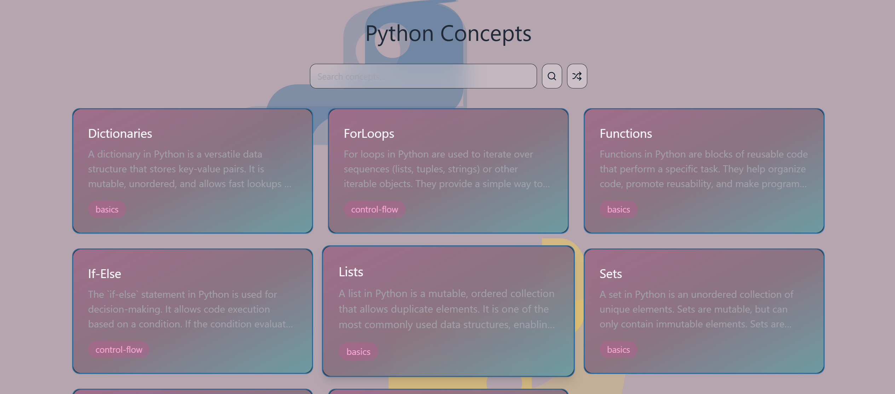
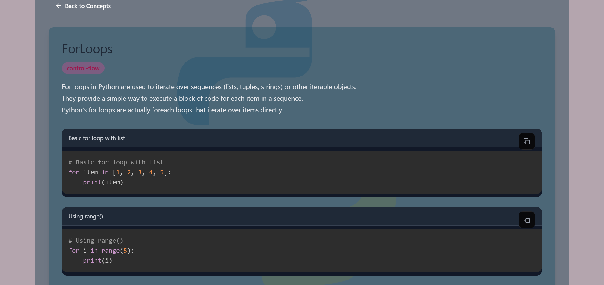
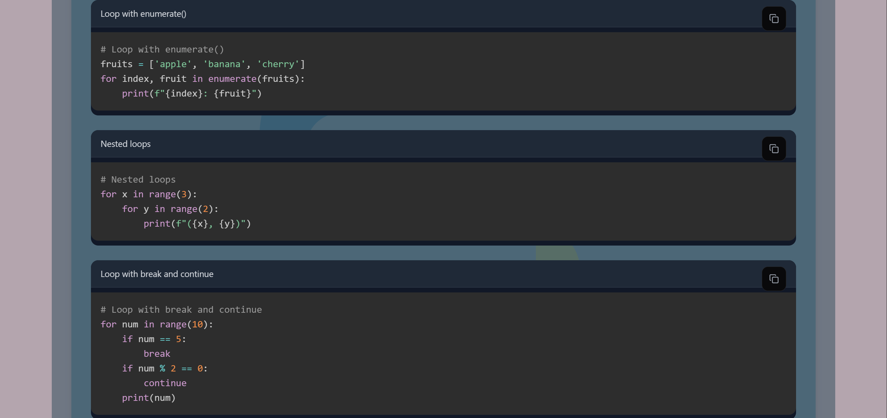

# A simple project for browsing Python concepts and example code.

---


---


### Main Browser


---

### Concept View



---

### Example Sections



---

Run commands from the root directory.

```bash
npm install
```
---
```bash
npm run build
```
---
```bash
npm run dev
```
---
Open:

```txt
http://localhost:5000
```
---

## All concept data is stored inside the `concepts/` directory.


## License

MIT License

---
