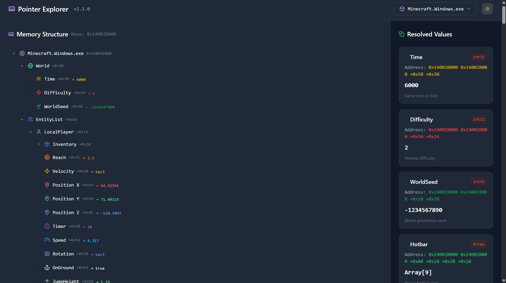

# Pointer Explorer

A visual memory exploration sandbox built for curiosity, experimentation, and absolutely unnecessary levels of UI polish.

---


### Install dependencies

```bash
npm install
```


```bash
npm run build
```


```bash
npm run dev
```

Open:

```txt
http://localhost:5000
```


## License

MIT License

---

## Final Note

Built with Replit AI

